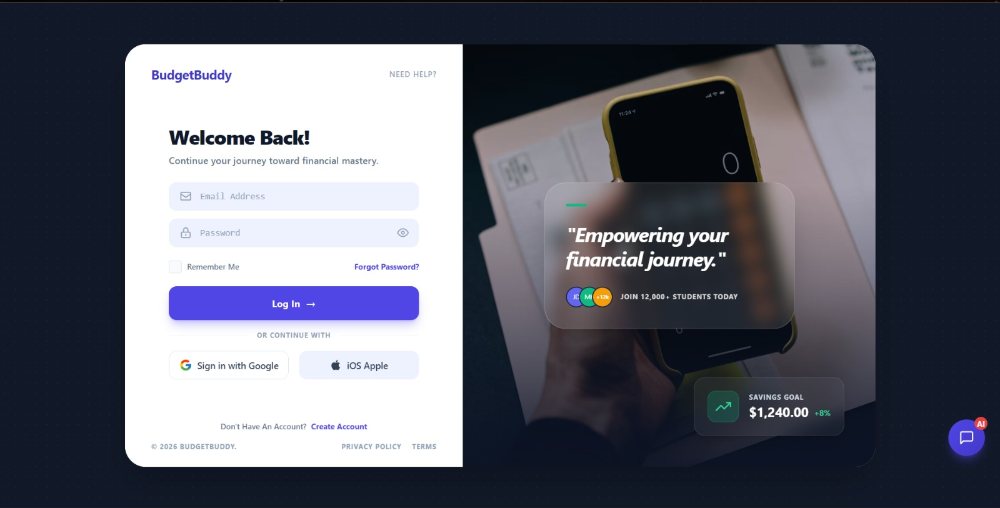
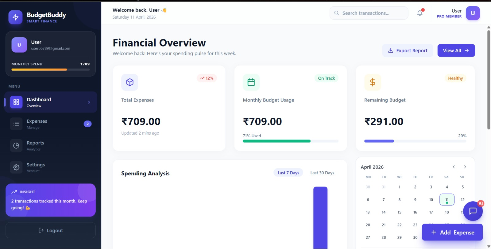
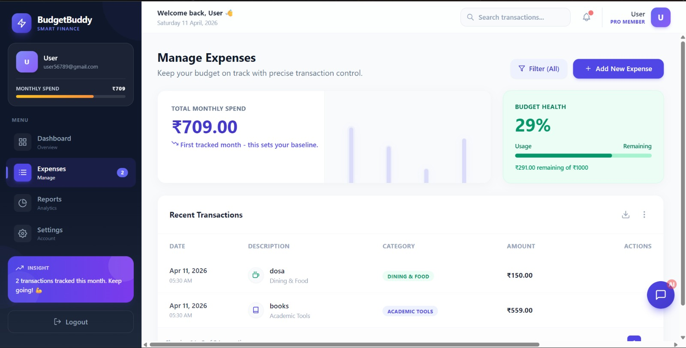
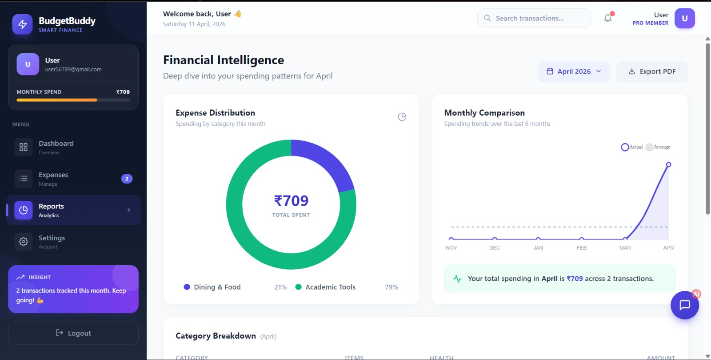
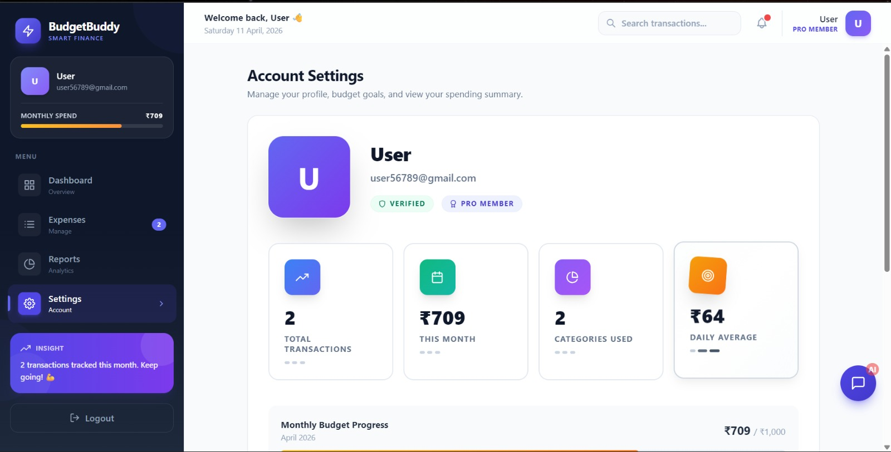

# 💸 BudgetBuddy (MERN Stack)

A modern **Personal Expense Tracker Web App** built using the **MERN Stack** (MongoDB, Express.js, React.js, Node.js).
Designed especially for students to manage and analyze their daily expenses with a clean and premium UI.

---

## 🚀 Features

* 🔐 User Authentication (Login / Signup)
* 📊 Interactive Dashboard with analytics
* 💰 Add / Edit / Delete Expenses
* 📅 Track daily & monthly spending
* 📈 Charts (Pie + Bar) for insights
* 🧾 Expense Categories (Food, Travel, Bills, etc.)
* 🔍 Search & Filter functionality
* 🌙 Dark Mode support

---

## 🚀 Tech Stack

### 💻 Frontend


### ⚙️ Backend


### 🗄️ Database


### 📊 Data Visualization


### 🤖 AI Integration


### 🚀 Deployment


### 🛠️ Tools


---

## 📂 Project Structure

```
BudgetBuddy/
│
├── frontend/                 # React Frontend
│   ├── public/
│   ├── src/
│   │   ├── assets/           # Images, icons
│   │   ├── components/       # Reusable UI components
│   │   ├── pages/            # Pages (Dashboard, Login, etc.)
│   │   ├── services/         # API calls
│   │   ├── utils/            # Helper functions
│   │   ├── App.jsx
│   │   └── main.jsx
│   ├── package.json
│   └── vite.config.js
│
├── backend/                  # Node.js Backend
│   ├── config/               # DB & environment config
│   ├── controllers/          # Business logic
│   ├── models/               # MongoDB schemas
│   ├── routes/               # API routes
│   ├── middleware/           # Auth, error handling
│   ├── services/             # AI services (Gemini, etc.)
│   ├── utils/                # Helper functions
│   ├── server.js             # Entry point
│   └── package.json
│
├── .env                      # Environment variables
├── README.md                 # Project documentation
└── package.json              # Root (optional)
```
---

### 1️⃣ Clone the repository
```bash
git clone https://github.com/Dev0ps404/BudgetBuddy.git
cd BudgetBuddy
```

---

### 2️⃣ Install dependencies

#### 📦 Frontend
```bash
cd frontend
npm install
```

#### ⚙️ Backend
```bash
cd ../backend
npm install
```

---

### 3️⃣ Setup Environment Variables

Create a `.env` file inside `backend/`:

```env
MONGO_URI=your_mongodb_connection_string
PORT=5000
JWT_SECRET=your_secret_key
GOOGLE_CLIENT_ID=your_google_client_id
GEMINI_API_KEY=your_gemini_api_key
```

---

### 4️⃣ Run the project

#### ▶️ Start Backend
```bash
cd backend
npm start
```

#### ▶️ Start Frontend
```bash
cd frontend
npm run dev
```

---

### 🌐 Access the App
https://budget-buddy-two-zeta.vercel.app/


---

## 📸 Screenshots

<p align="center">
  
  
  
</p>

<p align="center">
  
  
  
</p>

<p align="center">
  
  
</p>

---

## 🔐 Security

* Password hashing
* Input validation
* Protected routes

---

## 🚀 Future Improvements

* JWT Authentication
* Export reports (PDF/CSV)
* Budget alerts
* AI-based expense insights
* UPI Connection 

---

## 👨‍💻 Team & Responsibilities

- 🚀 Devansh Agarwal — Project Leader, Backend Developer & System Architect  
- 🎨 Govind Rana — Frontend Developer  
- 📊 Gagan — JavaScript & Charts Developer  
- 🧪 Sanskar — Tester & Debugger  

---

## ⭐ Support

If you like this project, give it a ⭐ on GitHub!
